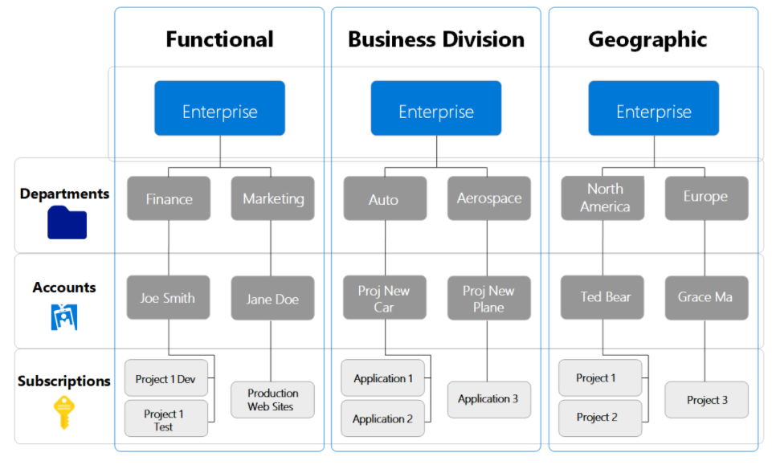

# Azure Payment FAQ

## What payment options do I have in purchasing Azure?
There are four payment options for Azure customers, including Azure Enterprise Agreement (EA), Azure in Open, Azure in CSP and Pay-As-You-Go with Credit Card. No matter it is prepaid or monthly invoice / charge back, all models will follow Pay-As-You-Go charging practice. Pay-As-You-Go with Credit Card is not recommeded for Education Institutes, this model may not fit school's finanical procedures. 

### Azure Enterprise Agreement (EA)
- Offical website for [Enterprise Agreement](https://docs.microsoft.com/en-us/azure/cost-management-billing/manage/ea-portal-get-started)
- EA follows prepaid payment approach
- EA requires three years contract with at least USD12k per year or USD36k for 3 years. 
- EA offers one year free standard support plan for customers. Customers can freely submit ticket for troubleshooting. 
- EA offers pricing lock down to ensure the pricing of all products. 
- EA allows customers to overuse the credits and sent invoice to charge back. For example, customer has 10k credits and he consumed 11k. EA will not terminate the resource. 
- Key difference - EA offers additional administrative EA Portal for comprehensive management. Admin can create multiple subscriptions by themselves and manage them with hierarchies. 

### Azure in Open
- Offical website for [Azure in Open](https://azure.microsoft.com/en-us/offers/ms-azr-0111p/)
- Open License follows prepaid payment approach (like an octopus card)
- Open License can be purchased as a credit key with minimum USD100 each. There is no minimum requirement on the number of keys in a single order. 
- Open License can be topped up to any subscriptions with any email addresses. For example, admin purchased 10 keys and distributed them to 10 users. Each user can activitate their own subscription with a valid key. 
- Open License does not cover any support plan by default. Users can not submit ticket for troubleshooting. 
- Open License does not allow customer to overuse the credits. If the users consumed all credits, all resources will be terminated temperarily. Once additional credit keys are topped up, the services will be resumed. From the positive view, Open License is good for those cases with restricted budget. Users will not have chance to overuse and the budget will not be excced. 
- Once the Open License keys are activiated, the credits will be expired in 1 year. 
- There is no hierarchies concept / portal for management. Open License is attached by subscription level. 

### Azure in CSP 
- Offical website for [Azure in CSP](https://azure.microsoft.com/en-us/offers/ms-azr-0145p/)
- CSP follows pay-as-you-go approach and send monthly invoice to customer. For example, customer consumed USD10 only in January, he will receive USD10 invoice in next month. 
- CSP can be created with zero upfront payment.
- CSP requires a CSP partner to manage the subscription for customer. 
- CSP offers unlimited support tickets but it has to be arranged by CSP partner. 
- CSP does not have a clear budget limit, uses can keep using services and pay by monthly basis. 
- CSP does not have restriction on expiration date. 
- There is no hierarchies concept / portal for management. CSP is attached by subscription level. 